# Corteva Code Challenge Template -> Weather Analysis and ETL
### Author: Abhijit Nayak
### Email: nabhijit787@gmail.com

# Python Environment Setup
Create a conda environment -> conda create -n virtualenv python=3.8 and then install the requirements.txt file using pip install -r requirements.txt command.

# Project Description
Analysis of weather data records from 1985-01-01 to 2014-12-31 for weather stations in Nebraska, Iowa, Illinois, Indiana, or Ohio.

## The main components of this project are:
1. ### src folder containing python modules -> data_preparation, database_operations, utils
2. ### data_model.py
3. ### main.py
4. ### swagger.json
5. ### AWS services that can be used for deployment of this project

#### Before proceeding ahead with detailed explanation of the project components, let's talk about the inital setup required in pgAdmin 4 (Open-Source Administration and Development Platform for PostgreSQL).

Setup the PostGres server as shown in the images below in the pgAdmin 4 tool. Provide the details: {server name: "CropETL", comments: "Corteva CropETL Assessment", hostname: "localhost", Port: 5432, Username: "postgres", password}
    
  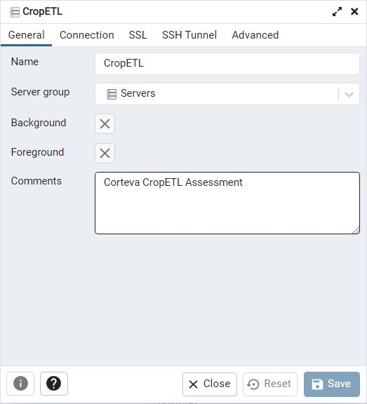
  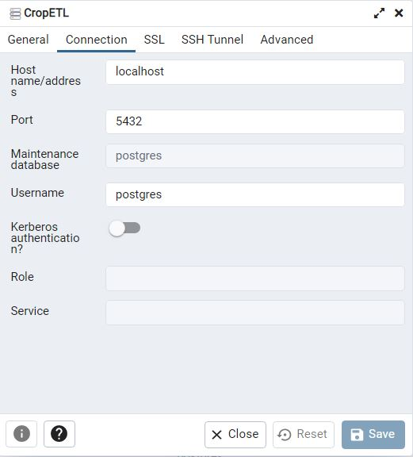

    Then create a database in this server by the following way:
    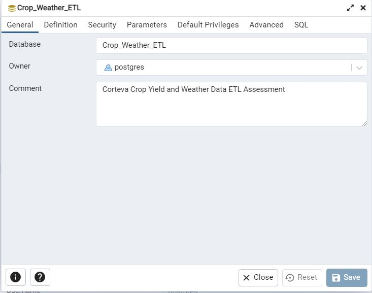
    After db is created in the pgadmin 4, create a config.ini file and set it as shown below:
                     [db_params]
                     hostname = localhost
                     port = 5432
                     dbname = Crop_Weather_ETL
                     username = postgres
                     password = XXXXXXXX

# src folder containing python modules -> data_preparation, database_operations, utils
    data_preparation.py and db_operations.py runs the ETL part of the process.
    utils.py reads db parameters from config.ini and is used while creating a conn object for postgre db.
* ### Data Extraction- data_preparation.py:
    PrepareData class has parameterized constructor which takes the folder path "cwd" of the data stored: 'folder path which contains wx_data and yld_data'. It also has weather_data_path which is created by joining the "cwd" parameter with wx_data(folder name) and a crop_data_path created similarly. These dataframes will be used in the methods of DBOperations class (database_operations python module) to ingest the data into respective postgres sql tables.
    weather_df {output of prep_data.prepare_weather_data().head()} and crop_df {prep_data.prepare_crop_data().head()} are:
            

* ### Data Transformation and Loading- database_operations.py:
    DBOperations class has a parameterized constructor which contains postgres connection and cursor. It reads the db_params dictionary object from utils python module.
        * **create_weather_data_table()** - creates 'weather_data' table
        * **create_crop_yield_table()** - creates 'crop_yield_data' table
        * **create_weather_data_transformed_table()** - creates 'weather_data_transformed' table
        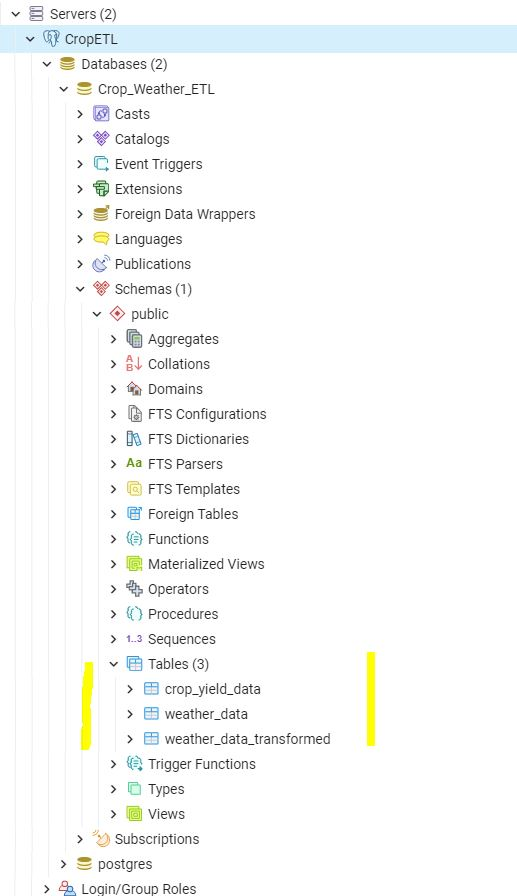
        * **fetch_data_table()** - takes in table name as a parameter and fetches all the data from that table.
        * **insert_data_into_table()** - takes a class_instance as one parameter which would be the instantiated PrepareData class and the other parameter is the table name. It then inserts data from the dataframe created from the PrepareData class and it's methods to the specific table defined as per the table_name parameter. It also has a check to prevent duplicate insertion in the table when the insert query is run again after it has already been ran once.

        In this method itself, there is a transformation operation being undergone on the raw data fetched from weather_data table. Some statistical computations are performed like average min and max temperature in celsius, total precipitation amount in centimeters where missing values {If the min and max temperature have values -999.9, then they are considered missing values. If the precipitation_amt has value as -99.99, then it's considered as missing too.} are ignored during statistical computations. Then these transformed data is inserted into weather_data_transformed  table.
        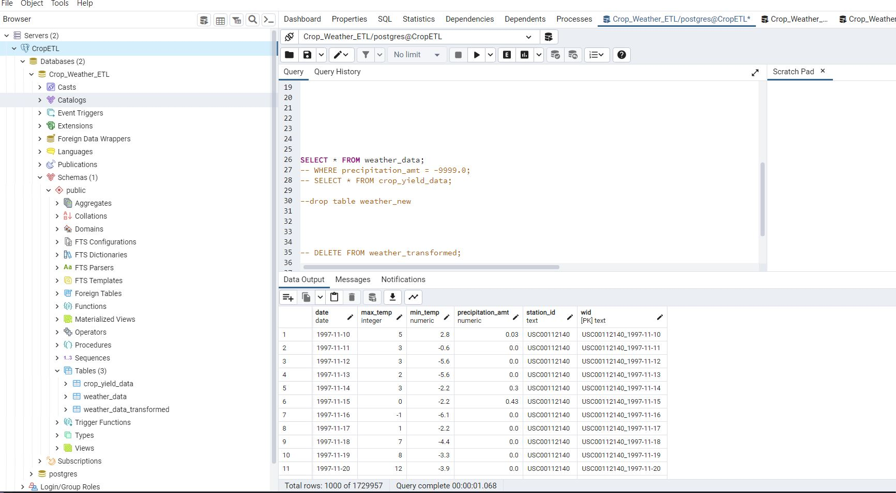
        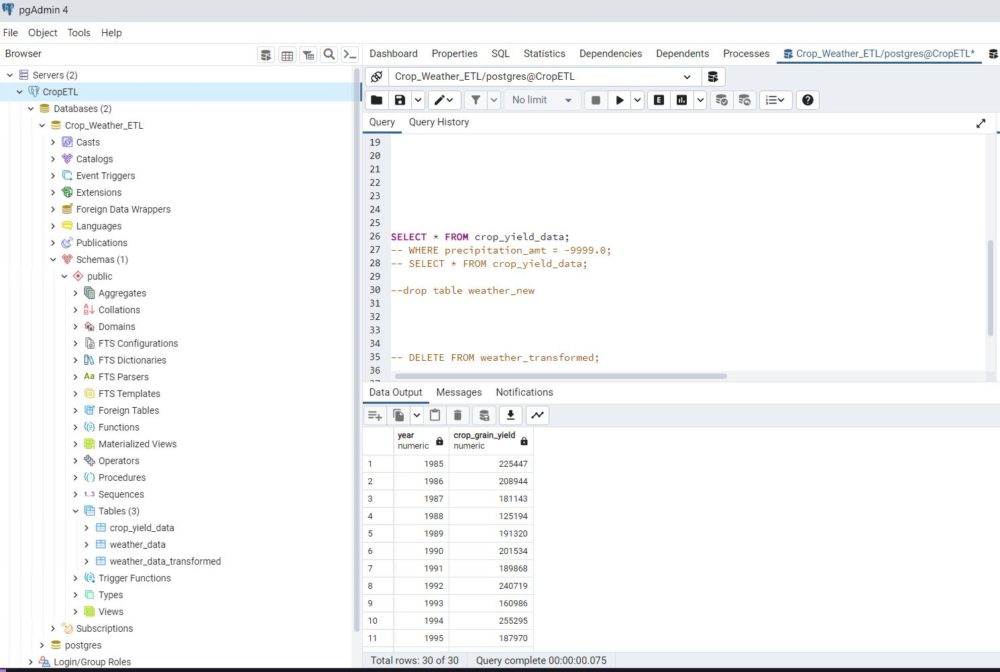
        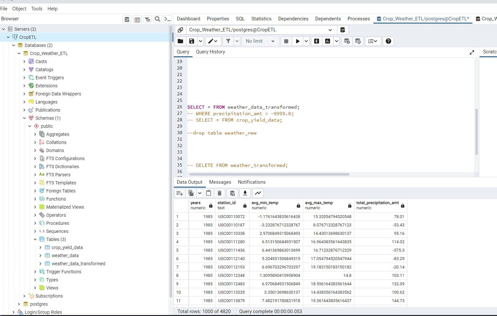
        
* ### utils.py:
    This python module contains code to read db parameters from the config file into db_params a dictionary object and has code for custom logging as well as custom exception.

    Logging Output:
    [ 2023-04-10 00:54:06,463 ] 8 root - INFO - weather data and crop data path variables created
    [ 2023-04-10 00:54:09,491 ] 29 root - INFO - weather dataframe created and ready for ingestion into Postgres Table
    [ 2023-04-10 00:54:09,554 ] 41 root - INFO - crop dataframe created and ready for ingestion into Postgres Table
    [ 2023-04-10 00:56:04,516 ] 8 root - INFO - weather data and crop data path variables created
    [ 2023-04-10 00:56:07,722 ] 29 root - INFO - weather dataframe created and ready for ingestion into Postgres Table
    [ 2023-04-10 00:56:07,789 ] 41 root - INFO - crop dataframe created and ready for ingestion into Postgres Table
    [ 2023-04-10 00:57:56,222 ] 14 root - INFO - Postgres Database connection and cursor objects initialized
    [ 2023-04-10 00:57:56,231 ] 36 root - INFO - Table created: weather_data
    [ 2023-04-10 00:57:56,257 ] 14 root - INFO - Postgres Database connection and cursor objects initialized
    [ 2023-04-10 00:57:56,261 ] 54 root - INFO - Table created: crop_yield_data
    [ 2023-04-10 00:58:02,356 ] 14 root - INFO - Postgres Database connection and cursor objects initialized
    [ 2023-04-10 00:58:02,365 ] 94 root - INFO - Ingestion process started at 2023-04-10 00:58:02.356827 and finished at 2023-04-10 00:58:02.365821, and a total number of 30 records were ingested.
    [ 2023-04-10 00:58:02,392 ] 14 root - INFO - Postgres Database connection and cursor objects initialized
    [ 2023-04-10 01:04:08,847 ] 94 root - INFO - Ingestion process started at 2023-04-10 00:58:02.393830 and finished at 2023-04-10 01:04:08.847021, and a total number of 1729957 records were ingested.
    [ 2023-04-10 01:07:47,100 ] 14 root - INFO - Postgres Database connection and cursor objects initialized
    [ 2023-04-10 01:46:46,004 ] 14 root - INFO - Postgres Database connection and cursor objects initialized
    [ 2023-04-10 01:58:32,275 ] 14 root - INFO - Postgres Database connection and cursor objects initialized
    [ 2023-04-10 01:59:45,059 ] 75 root - INFO - Table created: weather_data_transformed
    [ 2023-04-10 01:59:59,474 ] 14 root - INFO - Postgres Database connection and cursor objects initialized
    [ 2023-04-10 02:00:04,950 ] 15 root - INFO - Data Transformation process started at 2023-04-10 02:00:04.557299 and finished at 2023-04-10 02:00:04.950298, and a total number of 4820                      transformed records were ingested into a new table: weather_data.
    [ 2023-04-10 02:00:24,424 ] 15 root - INFO - Data Transformation process started at 2023-04-10 02:00:24.070853 and finished at 2023-04-10 02:00:24.424752, and a total number of 4820                      transformed records were ingested into a new table: weather_data.
    [ 2023-04-10 02:00:31,215 ] 14 root - INFO - Postgres Database connection and cursor objects initialized
    [ 2023-04-10 02:01:00,339 ] 114 root - INFO - Ingestion process started at 2023-04-10 02:00:58.360425 and finished at 2023-04-10 02:01:00.339757, and a total number of 4820 records were ingested.

    Sample CustomException:
    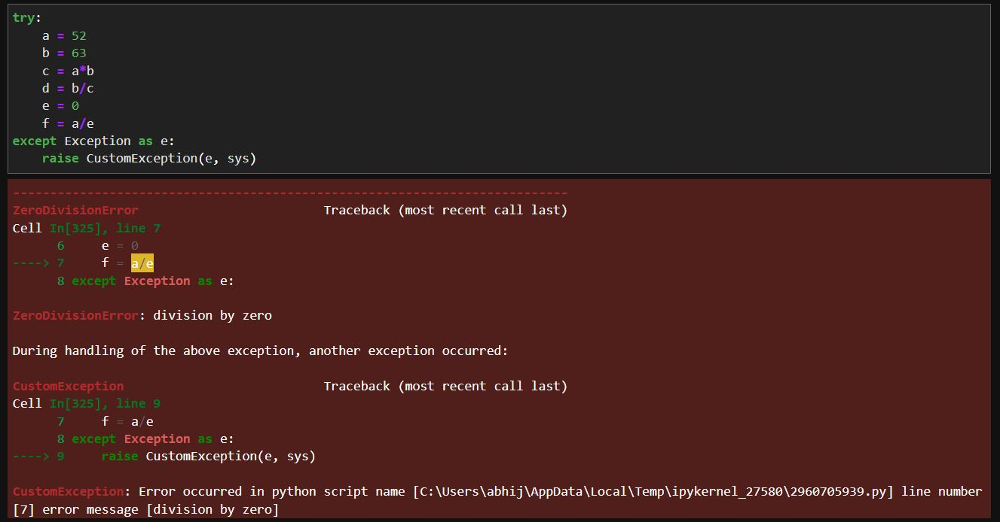

# data_model.py
    This python module executes the class methods defined in data_preparation and database_operations python module.

  * **Create weather_data Table:** 
    python .\data_model.py --create_weather_data_tbl "1"

  * **Create crop_yield_data Table:** 
    python .\data_model.py --create_crop_yield_tbl  "1" 

  * **Create weather_data_transformed Table:** 
    python .\data_model.py --create_weather_data_transformed_tbl  "1"

  * **Insert Data into weather_data Table:** 
    python .\data_model.py --insert_data_tbl  "1" --dir 'C:\Users\abhij\OneDrive - Indiana University\Interview Coding Tests\Corteva_Data Engineering\Weather-Data-Analysis_ETL' --tbl_name weather_data

  * **Insert Data into crop_yield_data Table:** 
    python .\data_model.py --insert_data_tbl  "1" --dir 'C:\Users\abhij\OneDrive - Indiana University\Interview Coding Tests\Corteva_Data Engineering\Weather-Data-Analysis_ETL' --tbl_name crop_yield_data

  * **Insert Data into weather_data_transformed Table:** 
    python .\data_model.py --insert_data_tbl "1" --tbl_name 'weather_data_transformed' --src_tbl_name 'weather_data'

# main.py
    This python module creates flask RESTful API endpoints with GET methods for http://127.0.0.1:5000/api/weather and http://127.0.0.1:5000/api/weather/stats  
    To run this, use command "python main.py"
    The first api endpoint: /api/weather returns all the records fetched from weather_data table based on the input query - params
      {
        start_date: "1994-05-01"
        end_date: "1998-04-01"
        station_id: "USC00110072"
        page_size: 3
        page_number: 1
      }
    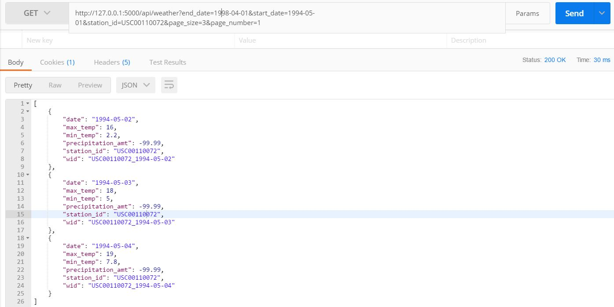

    The second api endpoint: /api/weather/stats returns all the records fetched from from weather_data table based on the input query - params (shown above) and returns transformed records based on statistical computations -> average max and min temperature and total precipitation amount.
    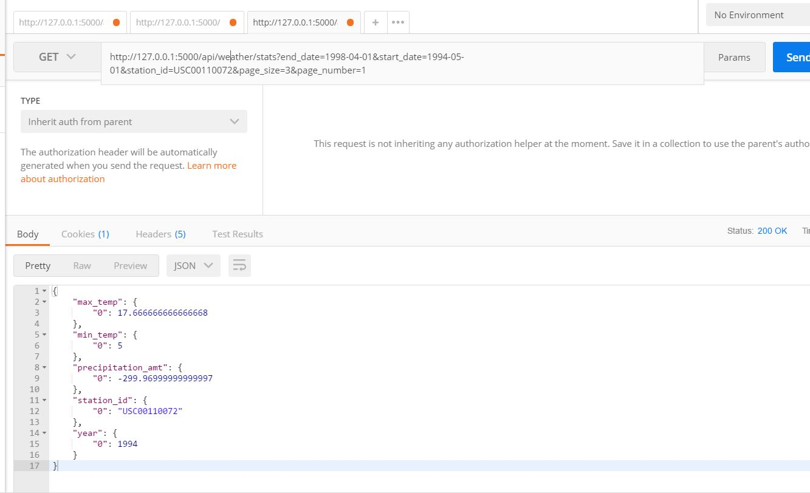

# swagger.json
    Swagger.json is a file that contains a machine-readable description of the RESTful web API. It is used for documenting, visualizing, and testing the API. The Swagger.json file specifies the API's endpoints, their parameters, and their responses. It can be used by various tools, such as Swagger UI or Postman, to generate documentation and a client SDK for the API. By providing a standardized way of describing APIs, Swagger.json helps developers and users understand how to interact with the API and facilitates the development of API-driven applications.

    Swagger UI configurations and blueprint are defined in the main.py module.

#### Swagger Endpoint -> http://127.0.0.1:5000/swagger/

    Swagger Screenshots:
    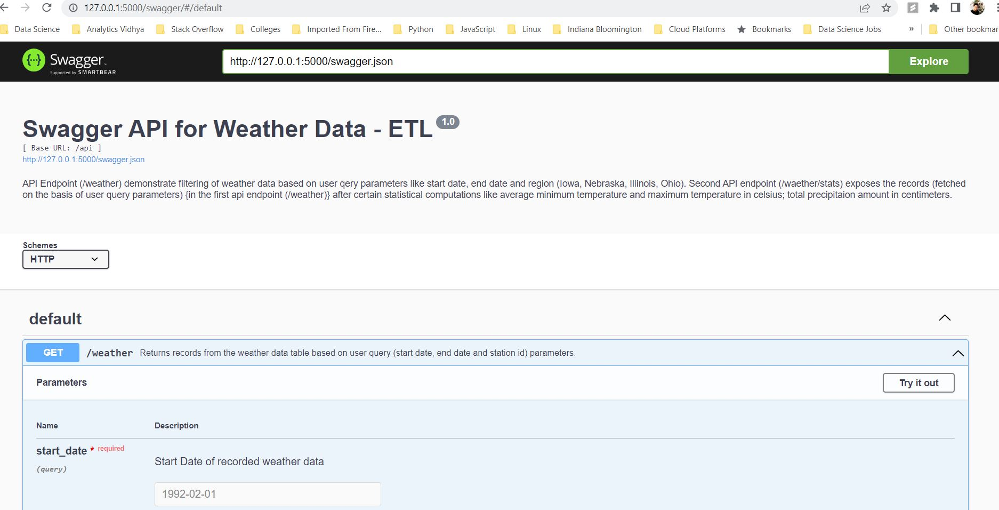
    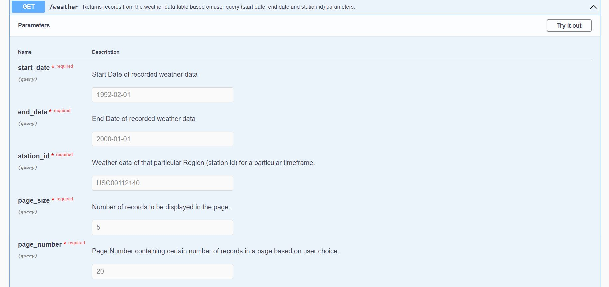
    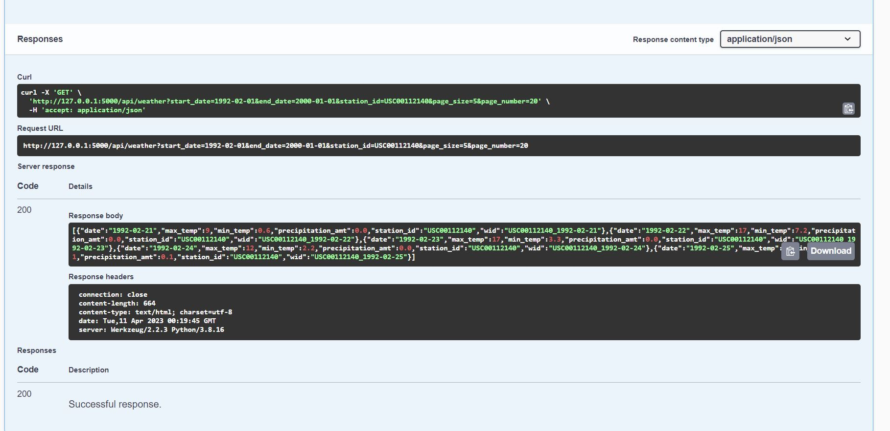
    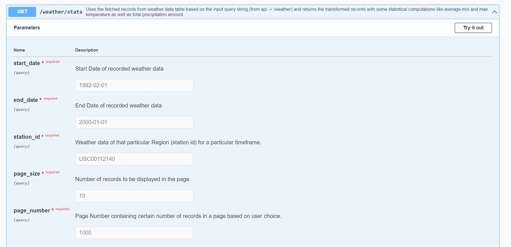
    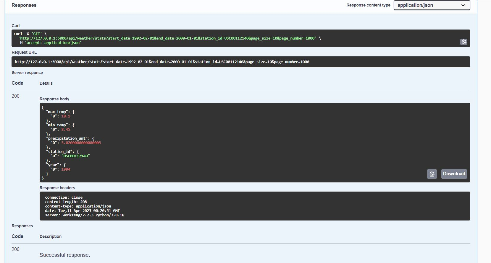

# AWS services that can be used for deployment of this project

* **Amazon EC2**: EC2 is a web service that provides resizable compute capacity in the cloud. EC2 can be used to create a virtual machine to run Flask app, the database operations, data preparation and other modules. Once all the required setup is done and the application is deployed, the web app can be accessed by appending port number such as 8080 to the IPv4 public ip address in the web browser.

* **AWS Lambda**: AWS Lambda is a serverless compute service that lets you run code without provisioning or managing servers. AWS Lambda can be used to schedule the data ingestion code written in Python to run at specific times.

* **AWS CodePipeline and Elastic Beanstalk**: A web app can be created in the AWS Elastic Beanstalk. Then, the whole project once pushed to a Github repository can be linked to the CodePipeline which would then link with Elastic Beanstalk as deployment provider and the environment created by the web app by beanstalk itself. So, after the github repo is linked with code pipeline which is then linked to elastic beanstalk web app. Then, a continuous delivery pipeline would be created with an URL available. That URL can be triggered in the web-app to access the web app. 
Moreover, github actions can be integrated into the project pushed into the repo which would then run based on the actions yaml file and act as a Continuous Inegration pipeline. 
So, if any code changes were done and pushed to the repo, github actions (CI) would be triggered and then the AWS CodeDeploy & Elastic Beanstlak would be triggered too as part of (CD). This is how we can incorporate CI/CD practices into this project.

   
